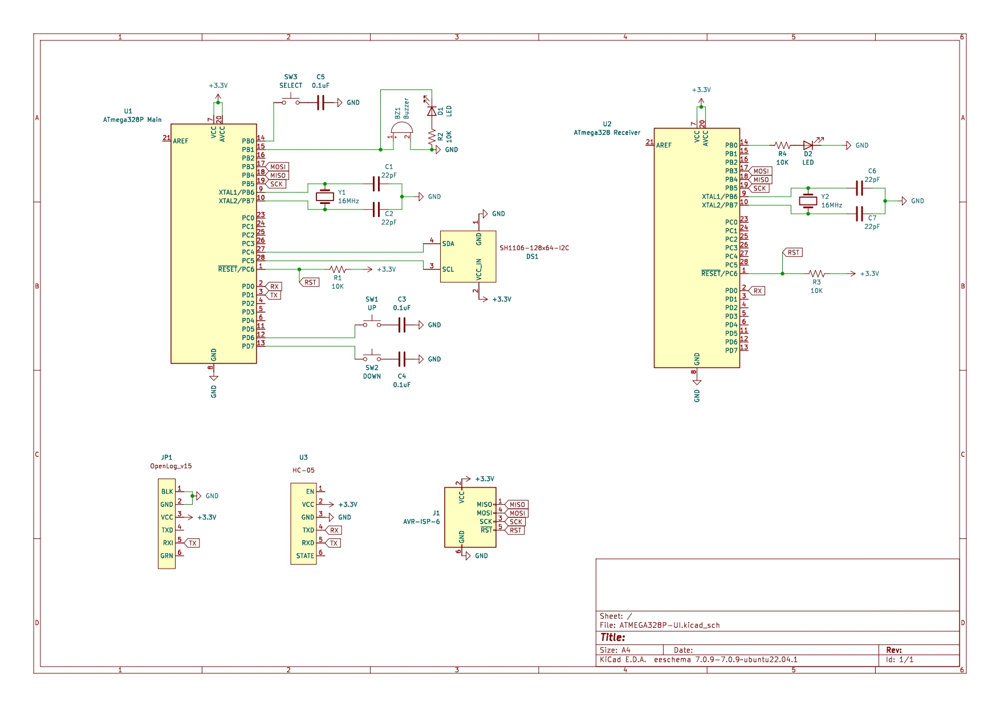

# AVR UI Experiment
## Overview
After the [AVR project](https://github.com/BnZel/understanding_avr_microcontrollers). I wanted to continue adding more components and experiment with the microcontroller, just to feed my curiosity.

The UI design uses bitmaps of the images that is stored in flash memory. There are three buttons: Up, Down, Select. It is used to navigate the menu. Each selection will display a new screen, showing the operation.

The main board (ATMega328P) acts like a "control panel" that displays three menu selections: 

* **UART:** Similar to the previous project, as an onboard UART receiver to test a simple LED blink (9600 Baud rate)

* **View Files:** This was meant to use [FatFs](http://elm-chan.org/fsw/ff/) or [Petit FatFs](http://elm-chan.org/fsw/ff/00index_p.html) to view files stored on the microSD/SD card. However, due to the complexity, I have yet to investigate this further.

* **BLE Buzz:** A buzzer connected that will active when selected. A blue LED will turn on. Sending a specific command will turn the buzzer and LED off. This acts like a lost and found device.

Upon every selection, a logger hooked up to the main boards UART pins receive what has been selected and records the process. The microSD/SD breakout board is connected to the SPI pins. Its purpose is to read the contents of files.

***NOTE: The microSD/SD breakout board is optional as it is still a work in progress.***

## Resources
* [Photopea for UI design](https://www.photopea.com/)
* [Bitmap image2cpp converter](https://javl.github.io/image2cpp/)
* [U8g2 library fonts](https://nodemcu-build.com/u8g2-fonts.php#collapse4)
* [Bluetooth Serial Terminal for HC-05](https://play.google.com/store/apps/details?id=de.kai_morich.serial_bluetooth_terminal&hl=en_CA&gl=US)

### Hardware Resources
* +3.3V power supply
* 6 pin ISP programmer
* Kingston Canvas Select Plus MicroSDHC 32 GB
* 16 MHz crystal oscillator - x2
* 10K ohm resistors - x4
* 22pF capacitor - x4 
* Blue LED - x2

#### Main board
* ATMega328P
* [SparkFun OpenLog](https://www.sparkfun.com/products/13712)
* HC-05 Wireless Bluetooth Module
* SH1106 128x64 I2C OLED
* 0.1uF capacitor - x3
* Tactile push buttons - x3

#### Receiver 
* ATMega328

### Software Resources:
* [avr-libc](https://www.nongnu.org/avr-libc/user-manual/modules.html)
* [MiniCore](https://github.com/MCUdude/MiniCore)
* [U8g2 Graphics for OLED](https://github.com/olikraus/u8g2)

#### Notes & References
* [Arduino OLED Menu Tutorial](https://www.youtube.com/watch?v=HVHVkKt-ldc&list=LL&index=21)
* [FatFs](http://elm-chan.org/fsw/ff/)
* [Petit FatFs](http://elm-chan.org/fsw/ff/00index_p.html)
* [littlefs](https://github.com/littlefs-project/littlefs)
* [AN2799 Using the Petit FAT File System Module with AVR® Microcontrollers](https://ww1.microchip.com/downloads/en/Appnotes/Petit-Fat-File-System-00002799A.pdf)
* [MMC/SD/SDHC Library](http://www.roland-riegel.de/sd-reader/index.html)
* [Interfacing a (micro)SD card with an Atmega328 microcontroller](https://shepherdingelectrons.blogspot.com/2015/09/interfacing-with-microsd-card-with.html)
* [Writing to a microSD card](https://bto.io/index.php?page=projects&article=writing_to_a_microsd_card)

**(Makefile included, this will include how to specifically compile the U8G2 library)**

### Demo

### Schematic

